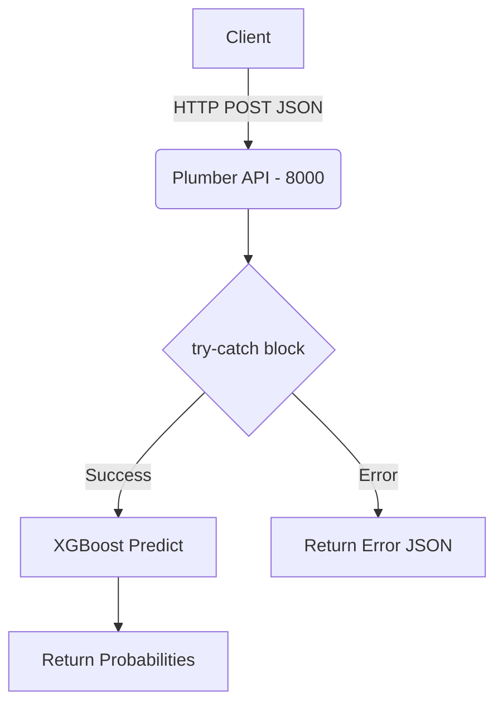

# Telco Churn XGBoost API

This repository provides an enterprise-ready, predictive API for identifying potential telecom customer churn using XGBoost.

## Architecture Diagram



## Step-by-Step Setup

1. **Clone the repository**:
   ```bash
   git clone <repo>
   cd -telco-churn-xgboost-shap-
   ```
2. **Train the Model** (optional if `xgboost_churn_model.rds` is present):
   ```bash
   Rscript src/TRAIN_IBM_TELCO_85.R
   ```
3. **Start the API**:
   ```bash
   docker-compose up --build -d
   ```
4. **Test the Health Endpoint**:
   ```bash
   curl http://localhost:8000/health
   ```

## Dependency Rationale

- **plumber**: Chosen for its lightweight footprint and native integration with R functions, allowing us to expose the model as a robust RESTful service.
- **xgboost**: Selected due to its superior gradient boosting framework which yields high AUC and explicitly handles non-linear feature interactions for churn data.
- **caret** & **smotefamily**: Essential for preprocessing and balancing classes during training, preventing bias towards the majority (non-churn) class.
- **tidyverse**: Provides readable and maintainable data wrangling capabilities.
- **Docker**: Ensures consistent behavior across dev, staging, and production by isolating the R runtime and dependencies.
